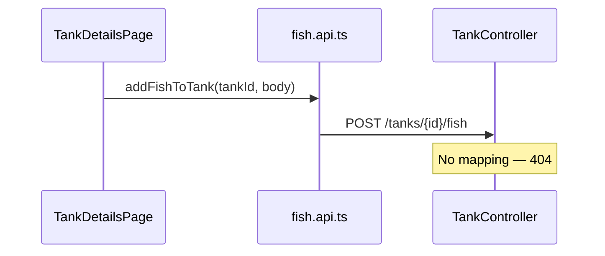

# Fix My Tanks — add/remove fish

## What you reported

On **My Tanks** → open a tank → **Add Fish** fails. The UI and API client are wired; the **server never implemented** fish endpoints.

## Root cause (confirmed in code)




| Layer    | File                                                                                                                          | What exists today                                                                        |
| -------- | ----------------------------------------------------------------------------------------------------------------------------- | ---------------------------------------------------------------------------------------- |
| UI       | `[frontend/src/pages/tanks/TankDetailsPage.jsx](frontend/src/pages/tanks/TankDetailsPage.jsx)`                                | Form calls `addFishToTank` / `removeFishFromTank` (lines 66–103)                         |
| Client   | `[frontend/src/api/fish.api.ts](frontend/src/api/fish.api.ts)`                                                                | `POST /tanks/{tankId}/fish`, `DELETE /tanks/{tankId}/fish/{fishId}`                      |
| Server   | `[backend/.../controllers/TankController.java](backend/src/main/java/com/fishmaster/backend/controllers/TankController.java)` | Only `GET/POST/PUT/DELETE` on `/tanks` — **no `/fish` routes**                           |
| DB logic | `[OnboardingService](backend/src/main/java/com/fishmaster/backend/service/OnboardingService.java)`                            | Already saves `Fish` via `FishRepository` during onboarding — same pattern can be reused |


`[normalize.ts](frontend/src/api/utils/normalize.ts)` already expects fish responses from `/tanks/{id}/fish` (lines 95–108), so the client is ready once the backend exists.

## Secondary issue: tank detail may not load fish list reliably

`[TankService.getTank](backend/src/main/java/com/fishmaster/backend/service/TankService.java)` uses `tankRepository.findById(id)` while `[TankRepository.findByIdWithFish](backend/src/main/java/com/fishmaster/backend/repositories/TankRepository.java)` already has a `LEFT JOIN FETCH` for `fish` + `fishType`. Without that, fish can be missing or fail to serialize depending on JPA lazy loading.

**Fix:** use `findByIdWithFish` for `GET /tanks/{id}` (and optionally for list if fish counts on `[MyTanksPage.jsx](frontend/src/pages/tanks/MyTanksPage.jsx)` show `0` incorrectly).

---

## Implementation plan

### 1. Backend — fish CRUD on tanks

Add methods to `[TankService](backend/src/main/java/com/fishmaster/backend/service/TankService.java)` (or a small `TankFishService`):

- `**addFish(user, tankId, FishDto)`**
  - Verify tank belongs to user (`findByIdWithFish` or ownership check)
  - Load `FishType` by `fishTypeId`; 400 if missing
  - Create `new Fish(tank, fishType, name)`, `fishRepository.save`, `tank.addFish(fish)`
  - **Recalculate water parameters** when `waterParameters.autoCalculated == true` (reuse overlap logic from `OnboardingService.calculateDefaultParameters` — extract to package-private helper to avoid duplication)
  - Return saved `Fish` (with `fishType` eager-loaded for JSON)
- `**removeFish(user, tankId, fishId)`**
  - Verify ownership; delete fish; recalc auto water params if needed
  - Return 204

Wire in `[TankController](backend/src/main/java/com/fishmaster/backend/controllers/TankController.java)`:

```java
@PostMapping("/{tankId}/fish")
public ResponseEntity<Fish> addFish(@PathVariable Long tankId, @RequestBody FishDto dto)

@DeleteMapping("/{tankId}/fish/{fishId}")
public ResponseEntity<Void> removeFish(@PathVariable Long tankId, @PathVariable Long fishId)
```

Use existing `[dto/FishDto](backend/src/main/java/dto/FishDto.java)` (`name`, `fishTypeId`).

Validation: non-blank name, required `fishTypeId`; map errors to 400 with clear message.

### 2. Backend — improve tank reads

- Change `getTank` to `findByIdWithFish` so `[TankDetailsPage](frontend/src/pages/tanks/TankDetailsPage.jsx)` always gets `fish[]` with `fishType`.
- Optional: add `@EntityGraph` or fetch join on `getUserTanks` so `[MyTanksPage](frontend/src/pages/tanks/MyTanksPage.jsx)` fish counts (`tank.fish.length`) are accurate on the grid.

### 3. Frontend — small hardening (no redesign)

In `[TankDetailsPage.jsx](frontend/src/pages/tanks/TankDetailsPage.jsx)`:

- Pass numeric tank id: `addFishToTank(Number(id), …)` / `removeFishFromTank(Number(id), …)` (params are strings).
- On success: toast (“Added Nemo!”) via existing `ToastProvider`; clear error banner.
- On failure: show server message (404 → “Could not save fish — try again”).

No change to `[MyTanksPage](frontend/src/pages/tanks/MyTanksPage.jsx)` flow beyond benefiting from correct fish counts — list/create/delete tank already works.

### 4. Verify (manual)

1. My Tanks → open tank → Add Fish (name + species) → fish appears in list after refresh.
2. Remove fish → list updates.
3. My Tanks card shows correct fish count.
4. Tank Advisor species warnings update after adding incompatible species (uses tank fish from DB).

---

## Out of scope (unless you ask)

- Redesigning My Tanks UI or removing Species Lab nav
- Inline “add fish” on the list page (stay on detail page)
- Editing fish name after create (only add/remove in v1)

## Files to touch


| File                             | Change                                                               |
| -------------------------------- | -------------------------------------------------------------------- |
| `TankController.java`            | `POST/DELETE` fish routes                                            |
| `TankService.java`               | add/remove fish + use `findByIdWithFish`                             |
| `OnboardingService.java`         | extract shared `recalculateWaterParameters(Tank)` (minimal refactor) |
| `TankDetailsPage.jsx`            | numeric id, success toast                                            |
| (optional) `TankRepository.java` | fetch fish on list query                                             |


